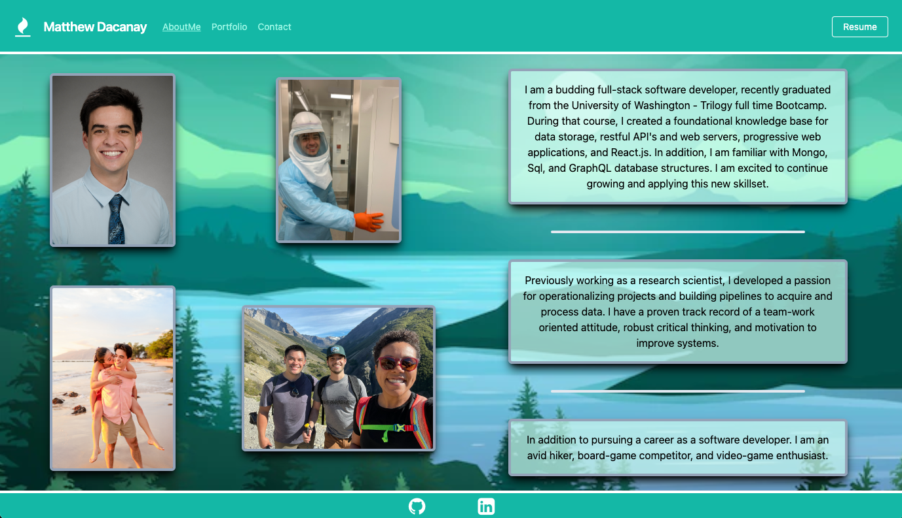
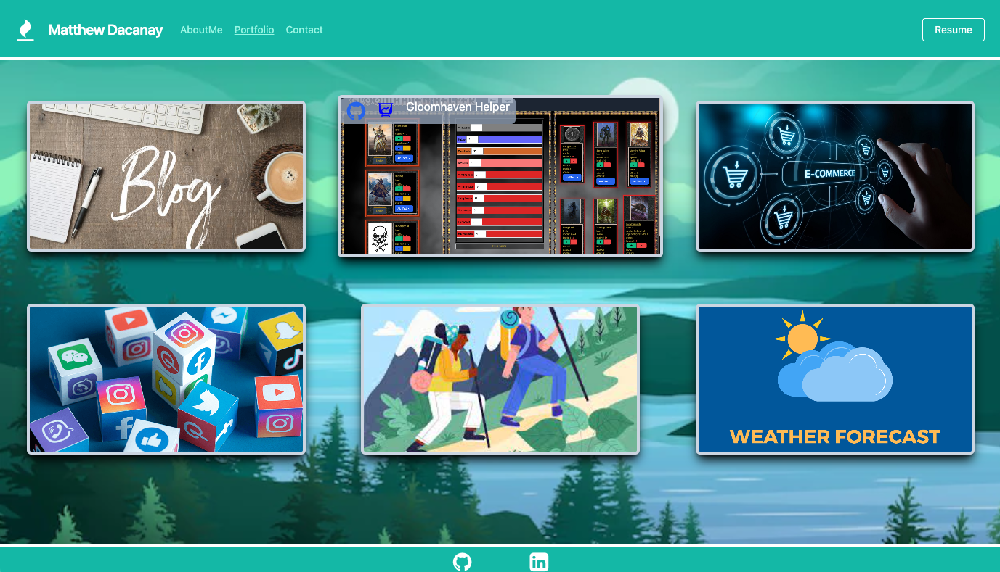
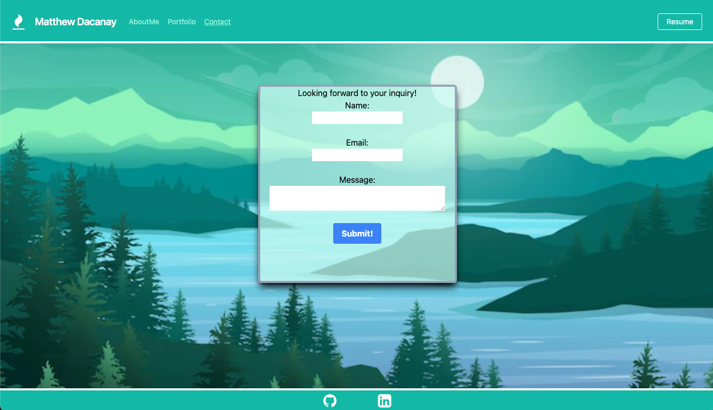
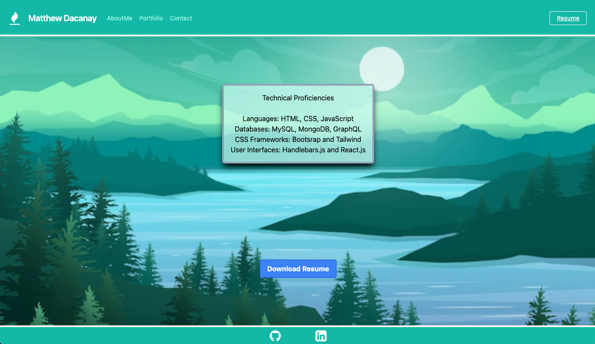

# react-portfolio-website 

## Description
This repository generates a react app that hosts a responsive portfolio website to demonstrate my technical proficiencies and highlight the projects that I am most proud of. React.js handles the delivery of the user interface by utilizing various components and pages that I have created. BrowserRouter is utilized to load different pages based off of links selected in the header. Links update styling based off of which page is loaded. useState and various handlers generate a react compatible form that alerts the user when fields are erroneous or missing data. I am most proud of the styling and hover transitions included on the portfolio page.

## Table of Contents
- [Screenshot](#screenshot)
- [Installation](#installation)
- [Usage](#usage)
- [License](#license)
- [Contributing](#contributing)
- [Tests](#tests)
- [Questions](#questions)

## Screenshot

## Installation
After cloning this repository, users need to open the working directory in a code editor and initialize an integrated terminal. There they can run the commands npm init-y and npm i to install the neccessary packages  to run this application. Then the application can be invoked with the command npm run start.

## Usage
This project was created for personal use, however if other users are attempting to modify as a learning process, changes can be made to the code base as long as they are syntactically correct. Again, the application can be invoked and viewed in  a default browser with the command npm run start.

## License
MIT License covers the contents of this repository. Please refer to the license documentation for more information. You can do so by googling MIT License.

## Contributing
Matthew Dacanay wrote the entirety of this application. Additional resources and public information were referred to on an as needed basis.

## Tests
There is no testing suite or associated unit tests included with this project.

## Questions
If you are interested in viewing more of my work, you can access public examples at [github page](https://github.com/mattdack)

